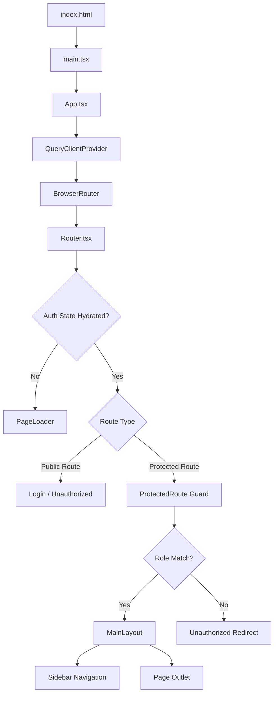
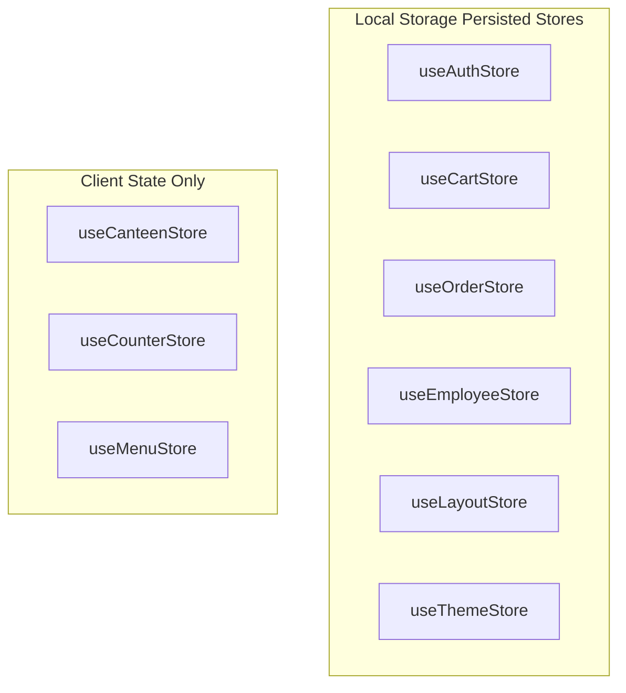
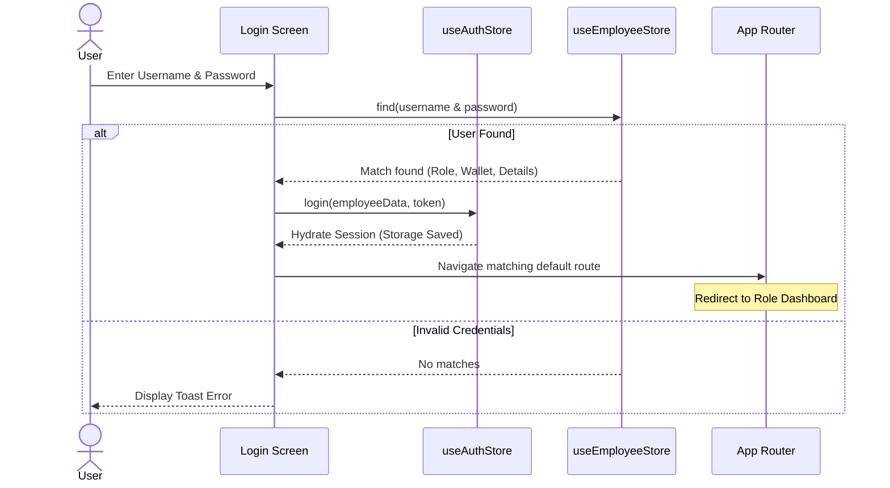
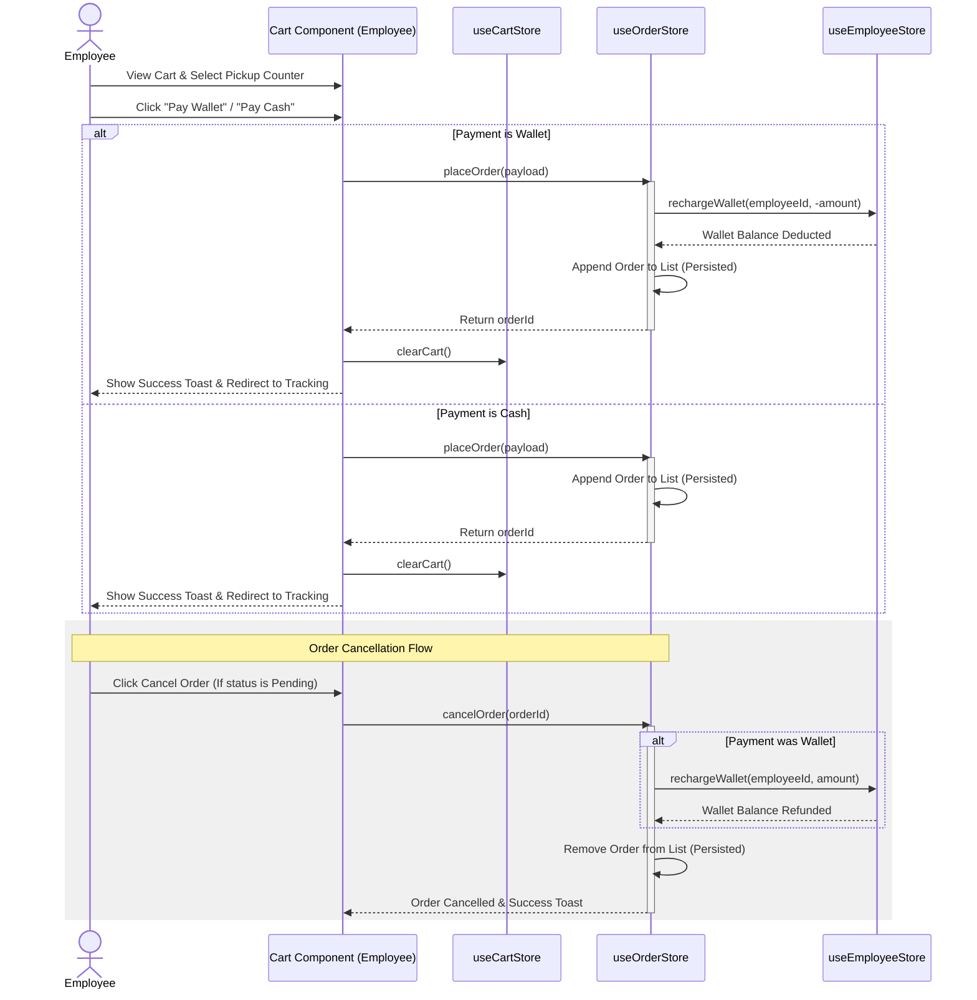

# 🍽️ Canteen Management System — Project Context

This document provides a comprehensive analysis and documentation of the Banswara Canteen Management System codebase, detailing its overall architecture, directory structure, routing system, components, state management, data flows, and configuration details.

---

## 🏗️ 1. Project Overview & Architecture

The Banswara Canteen Management System is a React-based client-side application designed to coordinate food ordering, canteen operations, wallet systems, counter pickup, and administrative reports for a manufacturing facility context (Banswara Syntex).

### Architectural Model
- **Single Page Application (SPA)**: Built on React 19 and Vite 8, utilizing Client-Side Routing (`react-router-dom`).
- **Local-First State Architecture**: The system utilizes Zustand for global client-side state management. To simulate database durability, state persistence is implemented using Zustand’s `persist` middleware, storing collections in `localStorage`.
- **Modular Feature Architecture**: Features are organized under domain boundaries (auth, admin, counter manager, employee, supervisor) containing their respective subfolders (dashboard, menu, orders, reports).
- **Asynchronous Route Loading**: Lazy-loading (`React.lazy` and `Suspense`) is applied to all route views to reduce initial bundle weight and optimize startup speed.



---

## 🛠️ 2. Tech Stack & Dependencies Analysis

The project integrates standard modern web tools to maintain responsive design, typography consistency, sound effects, and fast rendering.

### Core Stack
- **React 19**: Rendering library utilizing hooks and concurrent feature support.
- **TypeScript**: Adds strict typing definitions for employees, menu items, orders, and counters.
- **Tailwind CSS 3.4**: Used for application styling and dark/light theme switching.

### Dependencies Table (from `package.json`)

| Library | Version | Purpose |
| :--- | :--- | :--- |
| `react` | `^19.2.5` | Core UI library. |
| `react-dom` | `^19.2.5` | DOM renderer for React. |
| `react-router-dom` | `^7.14.2` | Configures declarative nested route hierarchies. |
| `zustand` | `^5.0.12` | Manages client-side stores (auth, order, cart, theme). |
| `axios` | `^1.15.2` | Configures client instances for future REST API linkage. |
| `@tanstack/react-query` | `^5.100.1` | Asynchronous query layer wrapper (registered but unused). |
| `react-hot-toast` | `^2.6.0` | Provides user notifications on database actions. |
| `sweetalert2` | `^11.26.24` | Displays modal confirmations for destructive user actions. |
| `lucide-react` | `^1.11.0` | Vector icon suite matching roles and sections. |
| `dayjs` | `^1.11.20` | Simple utility for relative ordering times and reporting dates. |
| `react-hook-form` | `^7.73.1` | Performance-optimized form fields tracker. |
| `zod` | `^4.3.6` | Schema validation library (registered in packages but unused). |
| `clsx` & `tailwind-merge` | Latest | Powers class merging logic in custom `cn` utility. |

---

## 🗂️ 3. Project Directory Structure & Responsibilities

The codebase utilizes clean separation of app bootstrap, routing, assets, design layout, state stores, and business modules.

```
f:\Banswara-canreen\
├── eslint.config.js          # Code linting rules
├── index.html                 # Main SPA HTML container entrypoint
├── package.json               # Manifest file containing scripts and dependencies
├── postcss.config.js          # PostCSS transformations for Tailwind
├── tailwind.config.js         # Tailwind system customization (colors, fonts, animations)
├── tsconfig.json              # TypeScript compilation base properties
├── vite.config.ts             # Vite project plugin configurations
└── src/
    ├── App.tsx                # Main entry component containing state wrappers
    ├── main.tsx               # Bootstrap code connecting React to root index.html
    ├── index.css              # Style system definitions, custom base tokens, and keyframe animations
    ├── app/
    │   └── Router.tsx         # Central routing registry and ProtectedRoute definitions
    ├── assets/
    │   └── audio/             # Sound effects (click.mp3, hover.mp3) for custom UI sounds
    ├── components/
    │   ├── auth/              # Auth-specific generic screens (Unauthorized fallback)
    │   ├── layout/            # Navigation layout shells (Sidebar, MainLayout, AuthLayout)
    │   └── ui/                # Core customizable components (Button, Modal, Input, Card)
    ├── config/
    │   └── authConfig.ts      # Unused fallback credentials list
    ├── features/
    │   ├── admin/             # Manage employees, canteens, counters, and general reports
    │   ├── auth/              # Login screen logic and quick access demo cards
    │   ├── counter/           # Counter manager dashboard, sales reports, and ticket delivery
    │   ├── employee/          # Mobile-friendly dashboard, counter menu selection, cart, and tracking
    │   └── manager/           # Supervisors' live order list overview
    ├── lib/
    │   ├── axios.ts           # Interceptor-enabled Axios API client
    │   └── queryClient.ts     # Unused QueryClient setup for server caching
    ├── store/                 # Zustand central stores (Cart, Order, Auth, etc.)
    ├── types/
    │   └── index.ts           # TypeScript interfaces (Employee, Order, Canteen, FoodItem)
    └── utils/
        └── cn.ts              # Utility helper wrapping clsx and tailwind-merge
```

---

## 🔐 4. Routing & Role-Based Access Control (RBAC)

The system enforces strict client-side path protection using role-based routing checks within `src/app/Router.tsx`.

### Roles Matrix

| Role Code | User Role Label | Authorized Paths |
| :--- | :--- | :--- |
| `super_admin` | Main Admin | `/admin/*`, `/manager/live-orders` |
| `canteen_supervisor` | Canteen Supervisor | `/admin/*`, `/manager/live-orders` |
| `counter_manager` | Counter Manager | `/manager/dashboard`, `/manager/live-orders`, `/manager/reports` |
| `employee` | Regular Employee | `/employee/*` |

### Route Definitions Table

| Route Path | View/Page Loader Component | Permitted Roles |
| :--- | :--- | :--- |
| `/login` | `Login.tsx` | All (redirects to home if authenticated) |
| `/unauthorized` | `Unauthorized.tsx` | All |
| `/admin/dashboard` | `AdminDashboard.tsx` | `super_admin`, `canteen_supervisor` |
| `/admin/manage-employees`| `EmployeesList.tsx` | `super_admin`, `canteen_supervisor` |
| `/admin/manage-canteen` | `CanteensList.tsx` | `super_admin`, `canteen_supervisor` |
| `/admin/manage-counters` | `CountersList.tsx` | `super_admin`, `canteen_supervisor` |
| `/admin/food-inventory` | `MenuList.tsx` | `super_admin`, `canteen_supervisor` |
| `/admin/analytics-reports`| `Reports.tsx` | `super_admin`, `canteen_supervisor` |
| `/manager/dashboard` | `CounterDashboard.tsx` | `counter_manager` |
| `/manager/live-orders` | `ManagerOrderList` / `CounterOrderList` | `canteen_supervisor`, `counter_manager` |
| `/manager/reports` | `CounterReports.tsx` | `counter_manager` |
| `/employee/dashboard` | `EmployeeDashboard.tsx` | `employee` |
| `/employee/counters` | `EmployeeCanteens.tsx` | `employee` |
| `/employee/menu` | `EmployeeMenu.tsx` | `employee` |
| `/employee/cart` | `Cart.tsx` | `employee` |
| `/employee/orders` | `EmployeeOrders.tsx` | `employee` |
| `/employee/history` | `OrderHistory.tsx` | `employee` |

---

## 📄 5. Pages & Views Catalog

### Auth Pages
- **Login (`features/auth/Login.tsx`)**: Secure authorization form featuring interactive Demo login credentials cards targeting direct role verification.
- **Unauthorized (`components/auth/Unauthorized.tsx`)**: Fallback boundary informing the user they are trying to load an RBAC-protected endpoint they do not have permissions for.

### Admin Pages
- **Admin Dashboard (`features/admin/dashboard/AdminDashboard.tsx`)**: Analytics screen presenting metrics like Total Employees, orders tracking, and Canteens count.
- **Manage Employees (`features/admin/employees/EmployeesList.tsx`)**: Employee roster containing a searchable list, role badges, and an interactive balance recharging panel.
- **Manage Canteens (`features/admin/canteens/CanteensList.tsx`)**: Admin list to deploy canteens, toggle statuses, and set managers.
- **Manage Counters (`features/admin/counters/CountersList.tsx`)**: Admin interface configuring kitchen distribution points, operational hours, and activation states.
- **Food Inventory (`features/admin/menu/MenuList.tsx`)**: Canteen manager menu configuring food items, pricing, category classification (Breakfast, Lunch, Dinner, Snacks, Tea), and marking "Food of the Day".
- **Reports & Analytics (`features/admin/reports/Reports.tsx`)**: Hub for financial auditing separating canteen revenue, employee balances, and food item popularity.

### Counter Manager Pages
- **Counter Dashboard (`features/counter/dashboard/CounterDashboard.tsx`)**: Live feed of cash vs wallet revenue and today's completed ticket counters.
- **Today Orders (`features/counter/orders/CounterOrderList.tsx`)**: Real-time order dispatch board for counter personnel. Enables updating statuses (`pending` -> `preparing` -> `ready` -> `completed`) and checking OTP values.
- **Counter Reports (`features/counter/reports/CounterReports.tsx`)**: Specialized report logs detailing cash vs. digital transactions for the matching counter manager.

### Employee Pages (Mobile-First)
- **Employee Dashboard (`features/employee/dashboard/EmployeeDashboard.tsx`)**: Mobile layout previewing active wallet balance, active vs. completed order counters, daily specials, and quick order links.
- **Browse Counters (`features/employee/canteens/EmployeeCanteens.tsx`)**: Canteen selection list directing employees to specific kitchens.
- **Food Menu (`features/employee/menu/EmployeeMenu.tsx`)**: Visual list of items grouped by category with custom add-to-cart badges.
- **Cart Checkout (`features/employee/cart/Cart.tsx`)**: Review system displaying quantities, taxes, selected pickup counter, and payment options (Wallet vs. Cash).
- **Order Tracking (`features/employee/orders/EmployeeOrders.tsx`)**: Real-time progress tracker containing status bars, cancellation buttons, and OTP numbers.
- **Order History (`features/employee/reports/OrderHistory.tsx`)**: Cumulative order logs showing totals, items list, and dates.

---

## 🧩 6. Components Catalog (Layout & UI)

The visual system is modular, using generic UI parts and shell layouts.

### Shell Layouts
- **MainLayout (`components/layout/MainLayout.tsx`)**: Root shell containing the global layout container, binding the responsive header navbar, mobile toggle button, and sidebar navigation drawer.
- **Sidebar (`components/layout/Sidebar.tsx`)**: Global sidebar providing navigation links matching user roles, user profile badge, collapse buttons, and system logouts.
- **AuthLayout (`components/layout/AuthLayout.tsx`)**: Background layout wrapper containing gradients and branding for the login form.

### Reusable UI Elements (`components/ui/*`)
- **BrandLogo (`BrandLogo.tsx`)**: Renders corporate logomark representation with options for collapsed and expanded views.
- **Button (`Button.tsx`)**: Highly structured button containing customizable options (`primary`, `secondary`, `destructive`, `ghost`), loading states, sizing variants, and triggers for custom sounds on click or hover.
- **Card (`Card.tsx`)**: Standard presentation card template.
- **Input (`Input.tsx`)**: Form input wrapper rendering layout helper text, focus rings, and custom errors.
- **Modal (`Modal.tsx`)**: Controlled portal wrapper handling screen overlays, animation slides, and close actions.
- **PageHeader (`PageHeader.tsx`)**: Shared title and subtitle layout.

---

## 💾 7. State Management Deep Dive (Zustand Stores)

All system databases are simulated within frontend Zustand stores inside `src/store/`.

### Zustand State Store Catalog



#### 1. `useAuthStore` (Persisted)
- **State**:
  - `user`: Currently authenticated employee record (`Employee | null`).
  - `token`: JWT bearer mockup string (`string | null`).
  - `role`: Role string (`'super_admin' | 'canteen_supervisor' | 'counter_manager' | 'employee' | null`).
  - `_hasHydrated`: Boolean tracking local storage hydration state.
- **Actions**:
  - `login(user, token)`: Activates session settings.
  - `logout()`: Clears storage references.
  - `setHasHydrated(state)`: Updates hydration flag.

#### 2. `useCartStore` (Persisted)
- **State**:
  - `items`: Active cart list (`CartItem[]`).
  - `canteenId`: Active canteen identifier (`string | null`).
  - `totalAmount`: Cart subtotal sum (`number`).
- **Actions**:
  - `addItem(item, canteenId)`: Adds items; if canteen changes, it resets and prompts a new cart.
  - `removeItem(cartItemId)`: Deletes selected line item.
  - `updateQuantity(cartItemId, quantity)`: Updates counter quantities.
  - `clearCart()`: Flushes cart arrays.

#### 3. `useEmployeeStore` (Persisted)
- **State**:
  - `employees`: Array of all system employee accounts (`Employee[]`).
- **Actions**:
  - `addEmployee(e)`: Creates a new user with a unique timestamp ID.
  - `updateEmployee(id, data)`: Modifies partial fields on active profiles.
  - `deleteEmployee(id)`: Removes profiles.
  - `rechargeWallet(id, amount)`: Increases an employee's wallet balance.

#### 4. `useOrderStore` (Persisted)
- **State**:
  - `orders`: Master registry of all placed orders (`Order[]`).
- **Actions**:
  - `placeOrder(order)`: Places a new ticket. If paid using `wallet`, it automatically deducts the grand total from the matching employee’s wallet.
  - `updateStatus(id, status)`: Modifies order progress (`pending` -> `preparing` -> `ready` -> `completed`).
  - `cancelOrder(id)`: Cancels pending order and automatically issues a refund to the employee's wallet if paid via `wallet`.

#### 5. `useCanteenStore` (Client Only)
- **State**:
  - `canteens`: Registry of canteens (`Canteen[]`).
- **Actions**: Add/update/delete/toggle canteen states.

#### 6. `useCounterStore` (Client Only)
- **State**:
  - `counters`: Registry of service counters (`Counter[]`).
- **Actions**: Add/update/delete/toggle counter states.

#### 7. `useMenuStore` (Client Only)
- **State**:
  - `items`: Master food menu items database (`FoodItem[]`).
  - **Actions**: Add/update/delete menu items, toggle item activation, set "Food of the Day".

---

## 🔒 8. Authentication & Authorization Flow



1. **Authentication Process**: The user logs in via `features/auth/Login.tsx`. Credentials verification runs against the `useEmployeeStore` state database.
2. **Session Storage**: On success, the matching user details and a mock token are saved to `auth-storage` in local storage via the `useAuthStore` persist configuration.
3. **Route Verification**: Upon page change, `<ProtectedRoute>` reads the store. If no session exists, users redirect back to `/login`. If the role is unauthorized for the target view, the router directs them to `/unauthorized`.

---

## 💼 9. Business Logic & Core Workflows

### Ordering & Wallet Transactions Flow



- **Insufficient Balance Guard**: The cart checks the employee's wallet balance:
  `if (method === 'wallet' && employee.walletBalance < grandTotal) { toast.error('Insufficient wallet balance'); }`
- **Taxes Calculation**: Order subtotal is subjected to a local 5% tax configuration prior to balance calculations:
  `grandTotal = subtotal + Math.round(subtotal * 0.05 * 100) / 100`
- **Dynamic Cart Reset**: The cart prevents cross-canteen ordering. Adding an item from Canteen B while the cart contains items from Canteen A triggers an automatic clear before adding the new item.

---

## ⚙️ 10. Environment Variables & Configurations

### Environment Configuration
The application runs entirely as a self-contained, client-side application. Consequently, there are **no environment variables (`.env` configurations)**. The application base URL points directly to `/api` within `axios.ts` interceptors to enable easy backend integration in the future.

### Tailwind Theme Config (`tailwind.config.js` & `index.css`)
Custom variables mapped using HSL tokens create a cohesive theme:
- **Navy Blue Theme** (`--primary` HSL `208 100% 28%` / Hex `#004b8d`): Reflects Banswara Syntex brand colors.
- **Gold Accent Theme** (`--secondary` HSL `39 48% 56%` / Hex `#c5a059`): Highlights status badges and summaries.
- **Modern Sans Typography**: Explicitly imports and forces `Roboto` across the entire document layout.
- **Dark Mode**: Configured using Tailwind's class strategy: the `<html>` node gains `.dark` to invert HSL tokens (e.g. converting background cards to deep charcoal).

---

## 🚀 11. Build, Deployment, & Execution Scripts

The project configures standard NPM scripts:

- `npm run dev`: Runs the local development server utilizing the command `vite --host`. This makes the application discoverable across local network hosts (essential for mobile testing).
- `npm run build`: Executes the TypeScript build compiler (`tsc -b`) checking for safety, followed by the command `vite build` to compile minimized assets into the production `/dist` folder.
- `npm run lint`: Triggers ESLint analysis to enforce code styling rules.
- `npm run preview`: Launches a local preview server hosting the compiled production bundle for review.

---

## ⚡ 12. Security & Performance Optimizations

### Security Configurations
- **Front-Gate Route Protection**: The `ProtectedRoute` blocks route changes unless the user exists in `useAuthStore` and their role is allowed.
- **Mock Token Invalidation**: Real authorization models are simulated inside `lib/axios.ts` response interceptors. If an API request encounters a `401 Unauthorized` response code, it automatically triggers `logout()` and redirects to `/login`.

### Performance Optimizations
- **Code Splitting**: Route components are imported via `React.lazy` and wrapped in `Suspense`. This breaks the output package into smaller files, meaning code is only fetched when a user navigates to that path.
- **Sound Effects Management**: Preloaded audio elements (`audio/click.mp3` and `audio/hover.mp3`) use local variables, playing only when user interactions occur to avoid blocking UI execution.
- **Debounced Rendering**: Roster searches rely on lightweight inputs to limit search filter calculations.

---

## 🛡️ 13. Error Handling Strategy

1. **User Interface Guards**: Forms disable submit actions while requests compile. Destructive delete actions prompt SweetAlert2 confirmation dialogs to prevent accidental clicks.
2. **Empty States**: Views verify array counts and render clean illustration messages (`<ClipboardList className="opacity-20" />`) with suggestions to prompt action.
3. **Zustand Initial State Safety**: The store hydration check prevents React components from loading elements that depend on local storage data before the data has finished loading from disk.

---

## 🔍 14. Discrepancies & Missing Documentation

Several inconsistencies exist between the actual codebase files and the architectural guidelines stated in `CLAUDE.md`:

1. **`zod` Usage**: Although `zod` is a package dependency, the components (such as `MenuList.tsx`, `CanteensList.tsx`, and `CountersList.tsx`) utilize basic `react-hook-form` inputs without actual Zod schema validation hooks or resolvers.
2. **Missing `hooks/` Folder**: `CLAUDE.md` claims the existence of custom hooks (such as `useAuth`, `usePagination`, `useDebounce`) inside a `src/hooks/` folder. In reality, no `src/hooks/` folder exists, and stores or raw hooks are used directly.
3. **Missing `utils/` Helpers**: `CLAUDE.md` documents helpers like `formatCurrency`, `formatDate`, and `exportPDF` in `src/utils/`. However, the only file under `src/utils/` is the tailwind CSS class merger utility `cn.ts`.
4. **Unused `ManagerDashboard.tsx`**: A dashboard view exists at `src/features/manager/dashboard/ManagerDashboard.tsx` but is not referenced in `Router.tsx`, as counter managers are routed directly to `CounterDashboard.tsx`.
5. **TanStack React Query**: Configured in `App.tsx` and `src/lib/queryClient.ts`, but all components fetch data directly from local Zustand state mockups, making React Query completely unused.
